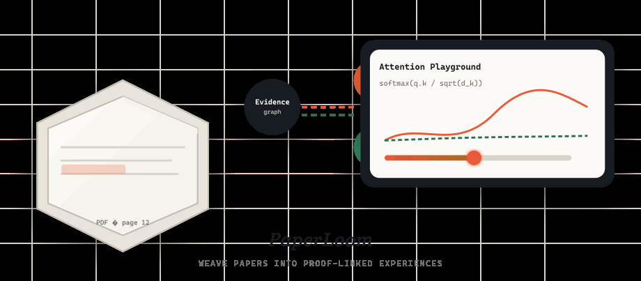
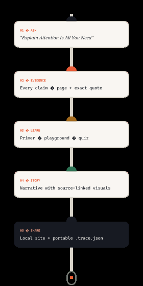
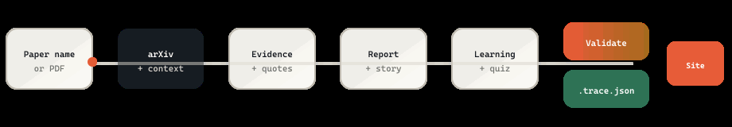
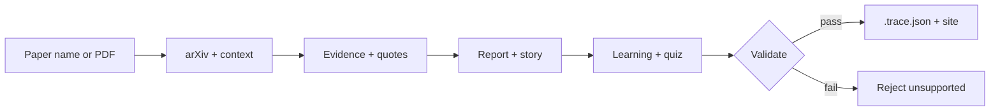
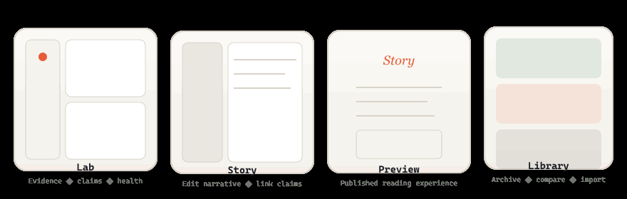
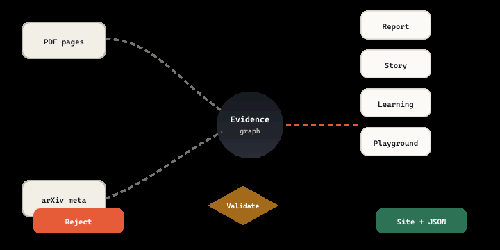

<div align="center">

# PaperLoom

*Weave papers into proof-linked experiences.*

**Name a paper. Get an interactive site where every claim points back to a page and a quote.**

PaperLoom turns research papers into verifiable, learnable, runnable workspaces — powered by the coding agent you already use, with no second API key.

<br/>



<br/>

<p>
  
  
  
  
</p>

<p><strong>Works with the agent you already have</strong></p>

<p>
  <a href="#claude-code"></a>
  <a href="#codex"></a>
  <a href="#antigravity-cli"></a>
</p>

<p>
  <a href="#install-in-under-a-minute"><strong>Install</strong></a> ·
  <a href="#how-it-works"><strong>How it works</strong></a> ·
  <a href="#what-you-get"><strong>What you get</strong></a> ·
  <a href="#the-full-application"><strong>Web app</strong></a> ·
  <a href="#development"><strong>Develop</strong></a>
</p>

</div>

---

## The problem

Summarising a paper takes seconds. **Trusting the summary takes hours.**

Ask any model to summarise a paper and you get fluent prose you cannot check. Which sentence came from which page? Is this something the authors measured, or something they suggested? To find out you have to go back to the paper — so the summary saved you nothing.

**PaperLoom inverts that.** Every claim carries the page and the exact quote it rests on. Measured results, author interpretation, and background are labelled separately. Anything the excerpt does not directly support is never marked verified.

<table>
<tr>
<td width="50%" valign="top">

**Typical AI summary**

- Prose you have to trust
- Claims blended together
- Uncertainty hidden
- Missing data → plausible guess
- Another API key

</td>
<td width="50%" valign="top">

**PaperLoom**

- Page + exact quote per claim
- Measured / interpretation / background
- Unsupported stays `needs-review`
- Source dropped, not guessed
- Your agent's existing model

</td>
</tr>
</table>

---

## One sentence is the whole interface

You do not need the PDF.

```text
Explain Attention Is All You Need using the PaperLoom plugin.
```

PaperLoom finds the paper on arXiv, downloads it, gathers published context (version history, DOI, venue, citation counts), reads it page by page, and opens a finished local site in your browser.

<table>
<tr>
<td width="65%" valign="top">

### How it works

1. **Ask** — name a paper or drop a PDF path
2. **Extract** — page-by-page text with `pdftotext`
3. **Build** — evidence graph, report, story, learning, playgrounds
4. **Validate** — reject unsupported claims before publish
5. **Open** — local site + full studio + portable `.trace.json`

</td>
<td width="35%" valign="top" align="center">



</td>
</tr>
</table>

---

<a id="how-it-works"></a>

## Pipeline

From paper name to proof-linked site — every stage is explicit and auditable.

<p align="center">
  
</p>



<details>
<summary><strong>What each stage produces</strong></summary>

| Stage | Output |
| --- | --- |
| **Paper name / PDF** | Resolved arXiv ID or local file path |
| **arXiv + context** | Metadata, version history, DOI, venue, citations |
| **Evidence + quotes** | Claims with page numbers and verbatim excerpts |
| **Report + story** | Structured report and narrative sections |
| **Learning + quiz** | Primer, playgrounds, self-check questions |
| **Validate** | Hard gate — unsupported claims are rejected |
| **Site + JSON** | Self-contained HTML site and portable `.trace.json` |

</details>

---

<a id="what-you-get"></a>

## What you get

<table>
<tr>
<td colspan="2" align="center">
  
</td>
</tr>
</table>

### Run the paper's own equations

Drag sliders on live playgrounds built from the paper's own formulas. Parameters start at verified values and warn you when you leave the region the paper actually tested.

### Learn what the paper assumes

Prerequisites ordered so nothing depends on something you have not read yet. Each one explains why *this* paper needs it — not a generic definition. LaTeX renders as native MathML.

### Check whether you understood it

Every quiz question links to evidence. Get one wrong and PaperLoom shows the page and the original quote behind the right answer.

### Read it as a narrative

Figures sit beside the paragraph that argues them — joined by shared claims, not guessed placement.

### See where the evidence is thin

The evidence health panel is auditable: verified vs needs-review counts, uncited page ranges, unused claims, and single-claim sections — all computed from project data, offline-safe.

### Compare two papers without picking a winner

Line up benchmarks under the same unit, duplicate definitions, and each side's limitations. Every number carries its source page; both papers stay visible.

### Send someone a link to one claim

Every claim and story section has its own anchor in the studio and in the portable single-file copy.

---

## Evidence chain

Nothing ships without provenance. The evidence graph is the hub — every surface links back to it.

<p align="center">
  
</p>

| Link type | What it means |
| --- | --- |
| **PDF pages** | Verbatim quote + page number |
| **arXiv meta** | Version, DOI, venue, citation context |
| **Claim → Evidence** | Measured, interpretation, or background |
| **Validate** | Unsupported claims blocked before publish |
| **Reject** | No site until evidence is fixed |
| **Site + JSON** | Portable archive you can reopen anywhere |

---

<a id="install-in-under-a-minute"></a>

## Install in under a minute

Pick your agent. Two commands, then restart — the plugin is the same on all three.

<a id="claude-code"></a>

### Claude Code

```bash
claude plugin marketplace add keshav-077/paperloom --scope user
claude plugin install paperloom@paperloom-tools --scope user
```

Restart Claude Code. That is it.

<a id="codex"></a>

### Codex

```bash
codex plugin marketplace add keshav-077/paperloom --ref main
codex plugin add paperloom@paperloom-tools
```

Restart Codex or open a new session. You can also invoke the skill with `$paperloom`.

<a id="antigravity-cli"></a>

### Antigravity CLI

Antigravity installs plugins from a directory, so clone first:

```bash
git clone https://github.com/keshav-077/paperloom.git
cd paperloom
agy plugin install plugins/paperloom
```

Confirm with `agy plugin list`, then restart the CLI or open a new session.

**Requirements:** Node.js 20+, and `pdftotext` (Poppler) for page-accurate extraction.

```bash
brew install poppler              # macOS
sudo apt install poppler-utils    # Debian / Ubuntu
```

### Then ask

```text
Explain Attention Is All You Need using the PaperLoom plugin.
```

```text
Take this paper and give me the output using the PaperLoom plugin: ./paper.pdf
```

When it finishes, the browser opens — self-contained site plus full application, project in your Library. Nothing to export, import, or start manually. A portable `.trace.json` lives alongside for archiving.

---

<a id="the-full-application"></a>

## The full application

The plugin is one way in. The web app adds generation with your own provider keys, an editable narrative, and a local library under `~/.trace/library`.

```bash
git clone https://github.com/keshav-077/paperloom.git
cd paperloom
npm install
npm run dev
```

Open `http://localhost:3000`. Press *Open the example project* (or `?sample=1`) for the fully enriched *Attention Is All You Need* demo.

| Workspace | Purpose |
| --- | --- |
| **Lab** | Inspect evidence, claims, and health metrics |
| **Story** | Edit narrative and link claims to sections |
| **Preview** | Published reading experience |
| **Library** | Archive, compare, and import projects |

---

## Project structure

```
paperloom/
├── plugins/paperloom/     # Agent plugin (Claude, Codex, Antigravity)
├── skills/paperloom/      # Skill definitions and scripts
├── src/                   # Next.js web application
│   ├── app/               # Routes and API
│   ├── components/        # UI — Lab, Story, Library, Compare
│   └── lib/               # Schema, validation, evidence logic
├── viewer/                # Portable single-file site renderer
├── scripts/               # Build, check, example generation
└── docs/
    ├── images/            # README illustrations (GIF/PNG; SVG sources)
    └── framer-reference/  # Design reference export
```

---

<a id="development"></a>

## Development

```bash
npm run dev              # development server
npm run lint             # eslint
npm run test             # vitest
npm run build            # production build
npm run check            # full CI locally
```

---

## License

[MIT](LICENSE) © Kesavardhan Makireddi

<div align="center">
<br/>
<sub>Built for researchers who verify before they trust.</sub>
<br/><br/>

</div>
