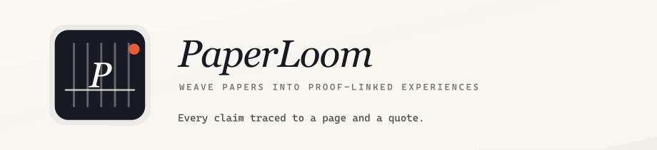
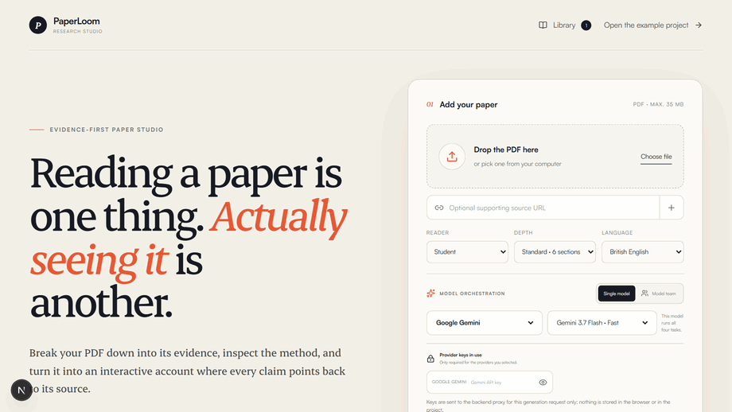
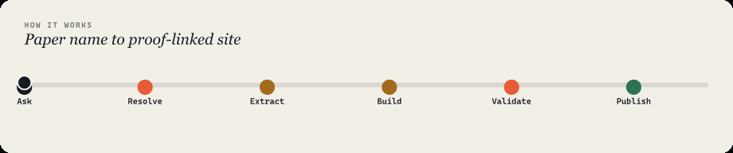
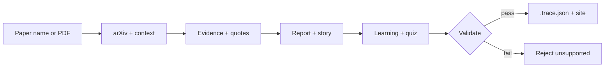
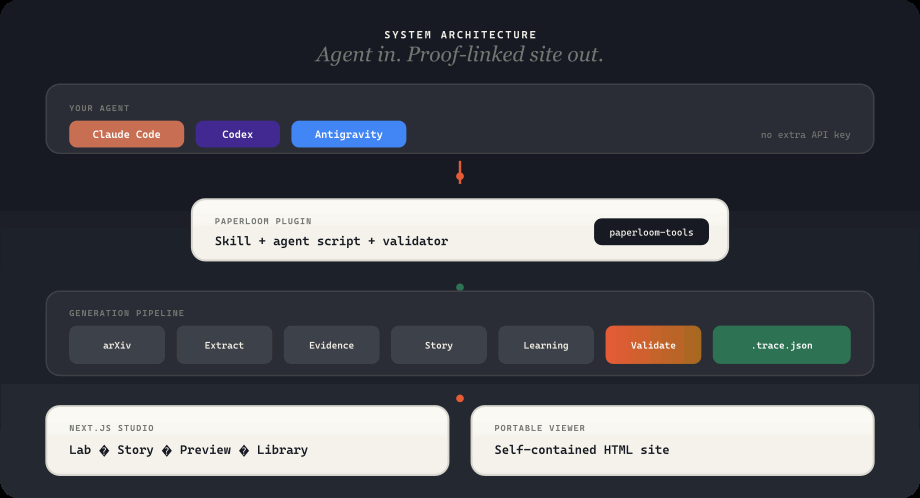
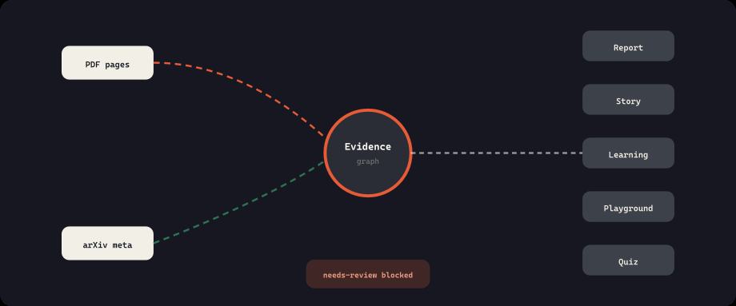
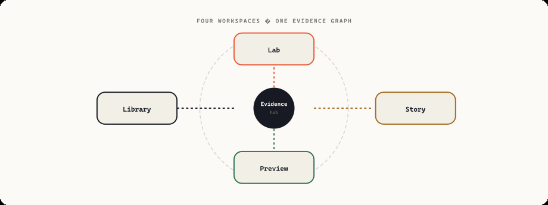

<div align="center">



<br/><br/>

**Name a paper. Get an interactive site where every claim points back to a page and a quote.**

PaperLoom turns research papers into verifiable, learnable, runnable workspaces — powered by the coding agent you already use, with no second API key.

<br/>



<br/>

<p>
  
  
  
  
</p>

<p><strong>Works with the agent you already have</strong></p>

<p>
  <a href="#claude-code"></a>
  <a href="#codex"></a>
  <a href="#antigravity-cli"></a>
</p>

<p>
  <a href="#install"><strong>Install</strong></a> ·
  <a href="#how-it-works"><strong>How it works</strong></a> ·
  <a href="#architecture"><strong>Architecture</strong></a> ·
  <a href="#what-you-get"><strong>What you get</strong></a> ·
  <a href="#development"><strong>Develop</strong></a>
</p>

<sub>Animated diagrams also available as <a href="docs/images/">SVG sources</a> in the repo.</sub>

</div>

---

## The problem

Summarising a paper takes seconds. **Trusting the summary takes hours.**

Ask any model to summarise a paper and you get fluent prose you cannot check. Which sentence came from which page? Is this something the authors measured, or something they suggested? To find out you have to go back to the paper — so the summary saved you nothing.

**PaperLoom inverts that.** Every claim carries the page and the exact quote it rests on. Measured results, author interpretation, and background are labelled separately. Anything the excerpt does not directly support is never marked verified.

<table>
<tr>
<td width="50%" valign="top">

**Typical AI summary**

- Prose you have to trust
- Claims blended together
- Uncertainty hidden
- Missing data → plausible guess
- Another API key

</td>
<td width="50%" valign="top">

**PaperLoom**

- Page + exact quote per claim
- Measured / interpretation / background
- Unsupported stays `needs-review`
- Source dropped, not guessed
- Your agent's existing model

</td>
</tr>
</table>

---

## One sentence is the whole interface

You do not need the PDF.

```text
Explain Attention Is All You Need using the PaperLoom plugin.
```

PaperLoom finds the paper on arXiv, downloads it, gathers published context (version history, DOI, venue, citation counts), reads it page by page, and opens a finished local site in your browser.

---

<a id="how-it-works"></a>

## How it works

From paper name to proof-linked site — every stage is explicit and auditable.

<p align="center">
  
</p>



| Step | What happens |
| --- | --- |
| **Ask** | Name a paper or point the plugin at a PDF |
| **Resolve** | arXiv ID, metadata, version history, DOI, venue |
| **Extract** | Page-by-page text via `pdftotext` |
| **Build** | Evidence graph, report, story, learning, playgrounds |
| **Validate** | Hard gate — unsupported claims are rejected |
| **Publish** | Local studio + portable `.trace.json` + static site |

---

<a id="architecture"></a>

## Architecture

Agent in. Proof-linked site out. No second API key — your existing Claude, Codex, or Antigravity session does the work.

<p align="center">
  
</p>

<table>
<tr>
<td width="50%" valign="top">

**Plugin path** (recommended)

1. Install `paperloom@paperloom-tools`
2. Ask your agent to run the skill
3. Browser opens with studio + site

</td>
<td width="50%" valign="top">

**Web app path**

1. Clone repo, `npm run dev`
2. Upload PDF or use provider keys
3. Edit in Lab / Story / Preview

</td>
</tr>
</table>

---

## Evidence model

Nothing ships without provenance. The evidence graph is the hub — every surface links back to it.

<p align="center">
  
</p>

| Link type | What it means |
| --- | --- |
| **PDF pages** | Verbatim quote + page number |
| **arXiv meta** | Version, DOI, venue, citation context |
| **Claim types** | Measured / interpretation / background |
| **Validate** | Unsupported claims blocked before publish |
| **`.trace.json`** | Portable archive you can reopen anywhere |

---

<a id="what-you-get"></a>

## What you get

Four workspaces orbit one evidence graph. Switch between them without losing provenance.

<p align="center">
  
</p>

| Workspace | Purpose |
| --- | --- |
| **Lab** | Inspect evidence, claims, health metrics, playgrounds |
| **Story** | Edit narrative and link claims to sections |
| **Preview** | Published reading experience |
| **Library** | Archive, compare, and import projects |

<details>
<summary><strong>Feature highlights</strong></summary>

- **Run the paper's own equations** — live playgrounds built from verified formulas
- **Learn what the paper assumes** — prerequisites ordered by dependency
- **Check whether you understood it** — quiz questions linked to evidence
- **Read it as a narrative** — figures beside the paragraphs that argue them
- **See where evidence is thin** — auditable health panel, offline-safe
- **Compare two papers** — benchmarks aligned, both sides visible
- **Deep-link any claim** — anchors in studio and portable export

</details>

---

<a id="install"></a>

## Install in under a minute

Pick your agent. Two commands, then restart — the plugin is the same on all three.

<a id="claude-code"></a>

### Claude Code

```bash
claude plugin marketplace add keshav-077/paperloom --scope user
claude plugin install paperloom@paperloom-tools --scope user
```

Restart Claude Code. That is it.

<a id="codex"></a>

### Codex

```bash
codex plugin marketplace add keshav-077/paperloom --ref main
codex plugin add paperloom@paperloom-tools
```

Restart Codex or open a new session. You can also invoke the skill with `$paperloom`.

<a id="antigravity-cli"></a>

### Antigravity CLI

```bash
git clone https://github.com/keshav-077/paperloom.git
cd paperloom
agy plugin install plugins/paperloom
```

Confirm with `agy plugin list`, then restart the CLI or open a new session.

**Requirements:** Node.js 20+, and `pdftotext` (Poppler) for page-accurate extraction.

```bash
brew install poppler              # macOS
sudo apt install poppler-utils    # Debian / Ubuntu
```

### Then ask

```text
Explain Attention Is All You Need using the PaperLoom plugin.
```

```text
Take this paper and give me the output using the PaperLoom plugin: ./paper.pdf
```

When it finishes, the browser opens — self-contained site plus full application, project in your Library. A portable `.trace.json` lives alongside for archiving.

---

## The full application

The plugin is one way in. The web app adds generation with your own provider keys, an editable narrative, and a local library under `~/.trace/library`.

```bash
git clone https://github.com/keshav-077/paperloom.git
cd paperloom
npm install
npm run dev
```

Open `http://localhost:3000`. Press *Open the example project* (or `?sample=1`) for the fully enriched *Attention Is All You Need* demo.

---

## Project structure

```
paperloom/
├── plugins/paperloom/     # Agent plugin (Claude, Codex, Antigravity)
├── skills/paperloom/      # Skill definitions and scripts
├── src/                   # Next.js web application
├── viewer/                # Portable single-file site renderer
├── scripts/               # Build, check, README asset generation
└── docs/images/           # README animations (GIF + SVG sources)
```

---

<a id="development"></a>

## Development

```bash
npm run dev                 # development server
npm run lint                # eslint
npm run test                # vitest
npm run build               # production build
npm run check               # full CI locally
npm run build:readme-assets # rebuild diagram GIFs from SVG sources
npm run capture:demo        # re-record website tour GIF (dev server required)
npm run readme:assets       # rebuild all README visuals
```

---

## License

[MIT](LICENSE) © Kesavardhan Makireddi

<div align="center">
<br/>

<br/><br/>
<sub>Built for researchers who verify before they trust.</sub>
</div>
